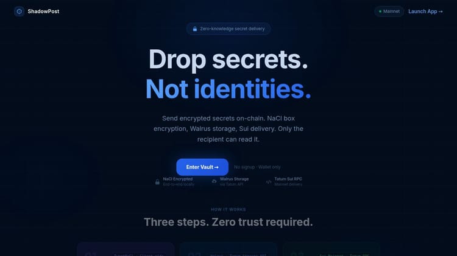
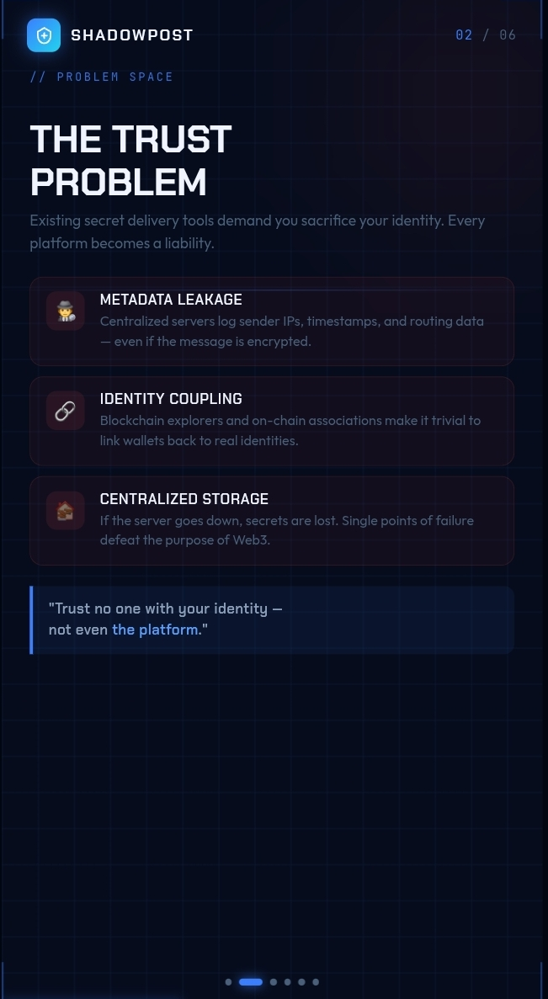
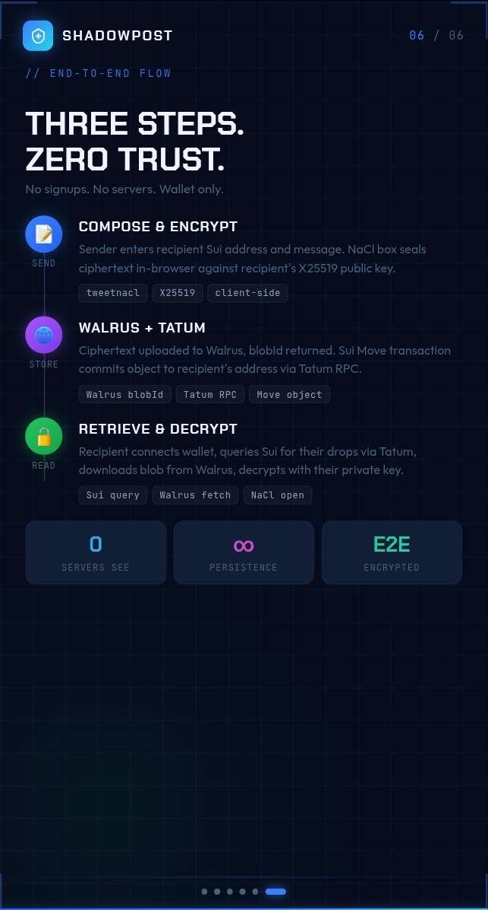
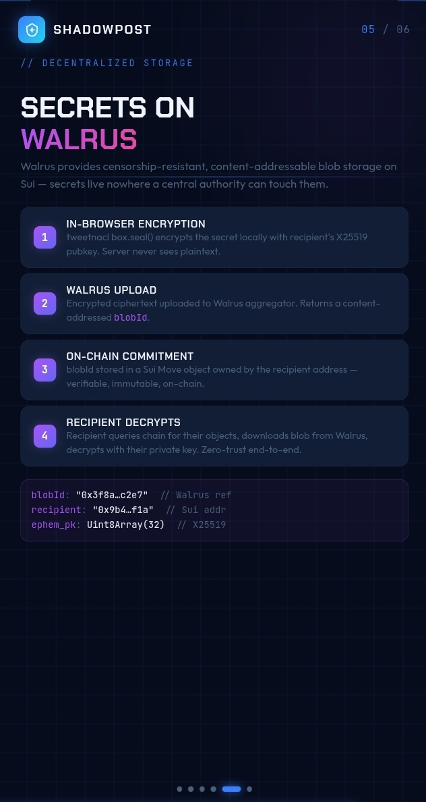
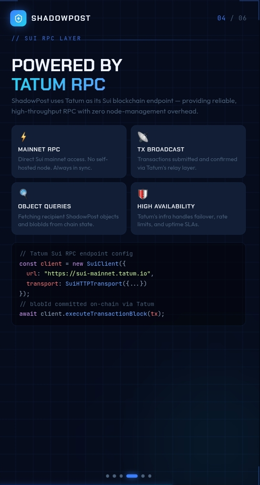
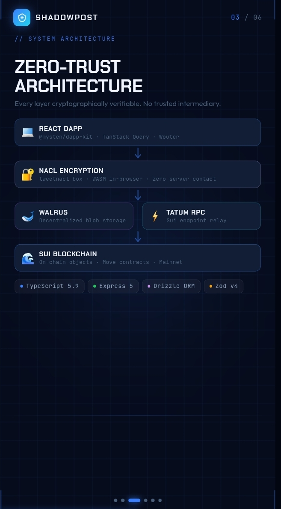
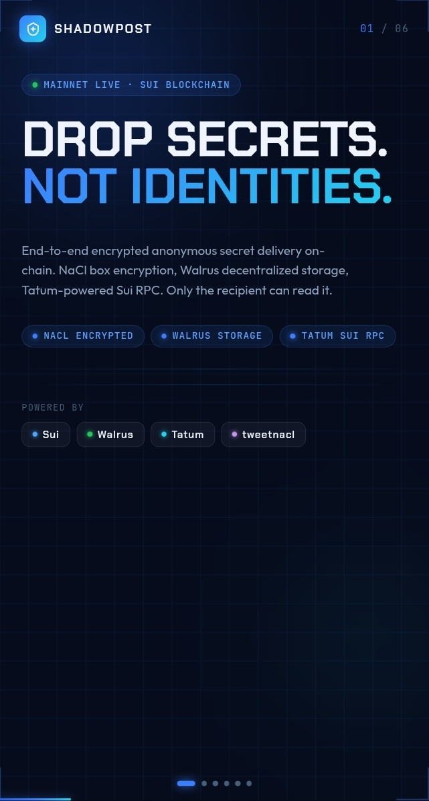

<div align="center">



<br/>
<br/>

# ShadowPost

### Drop secrets. Not identities.

**End-to-end encrypted anonymous secret delivery on Sui Mainnet.**  
NaCl box encryption · Walrus decentralized storage · Tatum-powered RPC · Zero signups.

<br/>

[](https://suiexplorer.com)
[](https://walrus.xyz)
[](https://tatum.io)
[](https://typescriptlang.org)
[](LICENSE)

</div>

---

## The Problem

<div align="center">

</div>

<br/>

Every existing secret-sharing tool makes the same broken promise: *"your message is encrypted"* — while silently logging your IP, timestamps, sender/recipient routing metadata, and storing your ciphertext on a server it controls.

| Threat | Reality |
|---|---|
| **Metadata Leakage** | Centralized servers log sender IPs, timestamps, and routing data — even if the message body is encrypted |
| **Identity Coupling** | Blockchain explorers and on-chain associations make it trivial to link wallets back to real-world identities |
| **Centralized Storage** | If the server goes down, secrets are lost. Single points of failure defeat the purpose of Web3 |

> *"Trust no one with your identity — not even the platform."*

ShadowPost solves all three. There is no ShadowPost server that sees your plaintext. There is no central database of messages. There is no account to create.

---

## How It Works

<div align="center">

</div>

<br/>

ShadowPost is built on a **three-step zero-trust pipeline**. Each step is cryptographically verifiable. No step requires trusting a third party with your plaintext.

### Step 1 — Compose & Encrypt (Client-side)

The sender enters the recipient's Sui address and writes their message. Immediately, **entirely in the browser**:

1. The recipient's X25519 public key is fetched from the on-chain registry
2. `tweetnacl.box.seal()` encrypts the message using **NaCl box construction** (X25519-XSalsa20-Poly1305)  
3. An ephemeral keypair is generated and discarded after sealing — forward secrecy by design

The plaintext is **never sent to any server**. Encryption happens in a WebAssembly NaCl runtime inside the browser tab. The server never sees it.

```ts
// All of this runs in the browser — zero server contact
const ephem = nacl.box.keyPair();
const sealed = nacl.box(
  msgBytes,
  nonce,
  recipientPublicKey,   // X25519 pubkey from on-chain registry
  ephem.secretKey       // ephemeral — discarded after this call
);
```

---

### Step 2 — Store on Walrus via Tatum

The resulting ciphertext blob is uploaded to **Walrus**, a decentralized content-addressable blob store built on Sui. ShadowPost does **not** call the Walrus aggregator directly from the client — all storage traffic is proxied server-side through **Tatum's Storage API**:

```
Browser  →  POST /api/walrus/upload  →  Tatum Storage API  →  Walrus Mainnet
```

Walrus shards and erasure-codes the blob across independent storage nodes. No single node holds the full ciphertext. The upload returns a **`blobId`** — a content-addressed identifier that is permanent, tamper-evident, and verifiable on-chain.

> Every uploaded blob is publicly verifiable at:  
> `https://aggregator.walrus-mainnet.walrus.space/v1/blobs/<blobId>`

<div align="center">

</div>

<br/>

```ts
// Server-side — Tatum Storage API proxies the blob to Walrus
const res = await fetch("https://api.tatum.io/v4/storage/walrus/upload", {
  method: "POST",
  headers: { "x-api-key": TATUM_API_KEY },
  body: encryptedBlob,
});
const { blobId } = await res.json();
```

---

### Step 3 — Commit on Sui via Tatum RPC

A **Sui Move transaction** is assembled and broadcast. It calls `shadowpost::send_secret`, which:

- Creates a `Secret` Move object on-chain
- Stores the `blobId`, the ephemeral public key, and the nonce inside it
- **Transfers the object directly to the recipient's Sui address**

All blockchain interaction — object queries, transaction simulation, and final broadcast — routes through **Tatum's Sui Mainnet RPC nodes**. ShadowPost configures `SuiClientProvider` with Tatum as its sole RPC endpoint:

```ts
// SuiProviders.tsx — ALL RPC goes through Tatum
const TATUM_RPC_PROXY = `${window.location.origin}/api/sui-rpc`;

const { networkConfig } = createNetworkConfig({
  mainnet: { url: TATUM_RPC_PROXY, network: "mainnet" },
});
```

```
Browser  →  /api/sui-rpc  →  Tatum Sui Mainnet Gateway  →  Sui Blockchain
```

<div align="center">

</div>

---

### Step 4 — Retrieve & Decrypt (Recipient)

The recipient connects their wallet. ShadowPost queries the Sui chain (via Tatum RPC) for all `Secret` objects owned by their address. For each object it:

1. Reads the `blobId` from chain state
2. Fetches the encrypted blob from Walrus
3. Decrypts it **locally in the browser** using the recipient's private key and the ephemeral public key stored on-chain

The decrypted plaintext is shown in the UI and never leaves the device. The blob URL is displayed so anyone can independently verify the ciphertext lives on Walrus.

---

## Architecture

<div align="center">

</div>

<br/>

```
┌─────────────────────────────────────────────────────┐
│                    React dApp                        │
│         @mysten/dapp-kit · TanStack Query · Wouter  │
└──────────────────┬──────────────────────────────────┘
                   │  all Sui RPC → /api/sui-rpc
                   │  all blob upload → /api/walrus/upload
                   ▼
┌─────────────────────────────────────────────────────┐
│             Express 5 API Server (Node.js)           │
│      Route: /api/sui-rpc  →  Tatum RPC Proxy        │
│      Route: /api/walrus   →  Tatum Storage Proxy     │
│      Route: /api/registry →  On-chain pubkey store   │
└──────────────┬──────────────────┬───────────────────┘
               │                  │
               ▼                  ▼
┌──────────────────┐   ┌──────────────────────────────┐
│  Tatum Sui RPC   │   │   Tatum Storage API (Walrus)  │
│  Mainnet Gateway │   │   → Walrus decentralized      │
│  High-availa.    │   │     blob storage network      │
└────────┬─────────┘   └──────────────────────────────┘
         │
         ▼
┌──────────────────────────────────────────────────────┐
│              Sui Blockchain (Mainnet)                 │
│   Move contract: shadowpost::send_secret             │
│   Secret { blobId, ephem_pk, nonce, recipient }      │
└──────────────────────────────────────────────────────┘
```

### Why Tatum handles both Walrus AND Sui RPC

ShadowPost uses Tatum as a **unified Web3 infrastructure layer** for two distinct purposes:

| Role | Tatum Service | What it replaces |
|---|---|---|
| **Sui RPC** | `https://sui-mainnet.gateway.tatum.io` | Self-hosted Sui fullnode |
| **Walrus blob upload** | `https://api.tatum.io/v4/storage/walrus` | Direct Walrus aggregator call |

This means ShadowPost has **zero self-managed blockchain infrastructure**. No fullnode to run. No Walrus aggregator to maintain. Tatum provides the reliability, rate-limit management, failover, and uptime SLA for both layers.

---

## Walrus: The Storage Layer in Depth

Walrus is a **decentralized blob storage protocol** built on Sui. Unlike IPFS, Walrus uses **erasure coding** — a blob is split into shards and distributed across independent storage nodes such that no single node can reconstruct the content alone, and the system remains available even if a fraction of nodes go offline.

For ShadowPost, Walrus is the perfect fit:

- **Censorship-resistant** — no central authority can delete a secret once stored
- **Content-addressed** — the `blobId` is a cryptographic commitment to the blob's content; any tampering is detectable
- **On-chain verifiable** — the `blobId` is stored directly inside the Sui Move object, making the storage proof immutable
- **No single point of failure** — the recipient can always retrieve their blob from any Walrus aggregator

```
blobId: "0x3f8a…c2e7"   // Walrus content address — stored on Sui
recipient: "0x9b4…f1a"  // Sui address — owns the Secret object
ephem_pk: Uint8Array(32) // X25519 ephemeral pubkey — decryption key
```

Every inbox message in ShadowPost includes a **"Verify blob on Walrus →"** link so the recipient — and any auditor — can independently confirm the encrypted ciphertext is stored exactly where the chain says it is.

---

## Screenshots

<div align="center">

| Landing | Problem Space |
|:---:|:---:|
|  |  |

| Zero-Trust Architecture | Powered by Tatum RPC |
|:---:|:---:|
|  |  |

| Secrets on Walrus | End-to-End Flow |
|:---:|:---:|
|  |  |

</div>

---

## Tech Stack

| Layer | Technology | Role |
|---|---|---|
| **Frontend** | React 18 + Vite + TypeScript 5.9 | dApp UI |
| **Wallet** | `@mysten/dapp-kit` | Sui wallet connection |
| **Encryption** | `tweetnacl` (NaCl box) | Client-side E2E encryption |
| **Blockchain RPC** | **Tatum Sui Mainnet Gateway** | All on-chain reads + tx broadcast |
| **Blob Storage** | **Walrus via Tatum Storage API** | Decentralized ciphertext storage |
| **Smart Contract** | Sui Move (Mainnet) | Secret object lifecycle |
| **API Server** | Express 5 + Node.js | Server-side proxy (Tatum, registry) |
| **Validation** | Zod v4 + Drizzle ORM | Schema validation |
| **Styling** | Tailwind CSS + Framer Motion | UI + animations |

---

## Smart Contract

The `shadowpost` Move package is deployed on Sui Mainnet.

**Package ID:**
```
0x99b5e921f24162117880eaeb9682e7e1675c09286e59fdbb34a0edb71280a00b
```

**`Secret` object structure:**
```move
public struct Secret has key, store {
    id: UID,
    blob_id: String,       // Walrus content address
    ephem_pk: vector<u8>,  // X25519 ephemeral public key
    nonce: vector<u8>,     // NaCl box nonce
    sender: address,
    timestamp_ms: u64,
}
```

The contract's `send_secret` function creates this object and **transfers it directly to the recipient address** — the recipient's wallet owns it, no server intermediary.

---

## Local Development

### Prerequisites

- Node.js 24+
- pnpm 10+
- A Tatum API key (get one at [tatum.io](https://tatum.io))

### Setup

```bash
git clone https://github.com/your-org/shadowpost
cd shadowpost
pnpm install
```

### Environment

Create a `.env` file in `artifacts/api-server/`:

```env
TATUM_API_KEY=your_tatum_api_key_here
SESSION_SECRET=any_random_secret_string
PORT=8080
```

### Run

```bash
# API server (port 8080, all Tatum proxying)
pnpm --filter @workspace/api-server run dev

# Frontend dApp (auto-assigned port)
pnpm --filter @workspace/shadowpost run dev
```

The shared reverse proxy routes `/api/*` to the API server and `/` to the frontend automatically.

### Useful commands

```bash
pnpm run typecheck               # Full TypeScript check
pnpm run build                   # Build all packages
pnpm --filter @workspace/api-spec run codegen  # Regenerate API hooks from OpenAPI spec
pnpm --filter @workspace/db run push           # Push DB schema (dev only)
```

---

## Security Model

| Guarantee | Mechanism |
|---|---|
| **Plaintext never leaves the device** | NaCl encryption runs in-browser before any network call |
| **Server never decrypts** | Server only proxies ciphertext bytes; it has no keys |
| **Tamper-evident storage** | Walrus `blobId` is a cryptographic commitment; any modification is detectable |
| **Recipient-exclusive decryption** | NaCl box can only be opened with the recipient's private key |
| **On-chain delivery proof** | Sui blockchain provides an immutable, timestamped record that a secret was delivered |
| **No accounts, no passwords** | Identity = your Sui wallet; no signup, no server-side user record |

---

## Hackathon Integration Summary

This project was built for a hackathon focused on **Walrus + Tatum integration**. Here is exactly where each service is used:

### Tatum — Used for Two Critical Roles

**1. Sui Mainnet RPC (all blockchain traffic)**
- `SuiClientProvider` is configured with `${origin}/api/sui-rpc` as its sole RPC URL
- The `/api/sui-rpc` route forwards every JSON-RPC call to Tatum's gateway
- This covers: `getOwnedObjects`, `getObject`, `executeTransactionBlock`, `dryRunTransactionBlock`, and all other Sui methods

**2. Walrus Storage API (all blob uploads)**
- The `/api/walrus/upload` route calls `https://api.tatum.io/v4/storage/walrus/upload`
- Every secret stored on Walrus goes through Tatum's storage infrastructure

### Walrus — The Decentralized Backbone

- Every encrypted message is stored as a blob on the Walrus mainnet network
- The `blobId` returned by Walrus is the sole content reference stored on-chain
- Recipients retrieve blobs directly from the Walrus aggregator network
- Every message in the inbox includes a live **"Verify blob on Walrus →"** link

---

## License

MIT © ShadowPost Contributors

---

<div align="center">

Built with [Sui](https://sui.io) · [Walrus](https://walrus.xyz) · [Tatum](https://tatum.io) · [TweetNaCl](https://tweetnacl.js.org)

*"0 servers see. ∞ persistence. E2E encrypted."*

</div>
